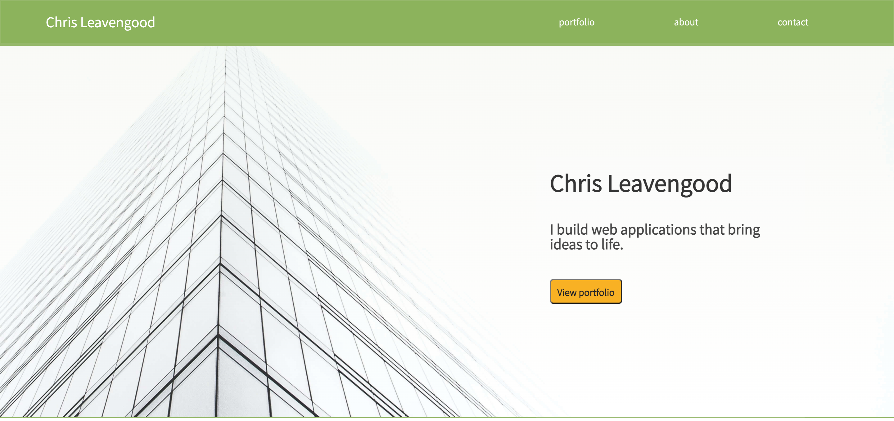

# Portfolio

## Description
This project provided an opportunity to apply a wide range of HTML and CSS skills that we've been learning in the DU Bootcamp. It also gave me a chance to apply many of the UX skills that I picked up during my recent Udemy course that I completed over our Christmas break.

I approached this project from a slightly different lens than the prompt. Since I'm not seeking a career change after this bootcamp, I didn't present the information as though I was looking for a junior developer job. I approached it instead from the perspective of an independent consultant who was targeting a new client as their potential "employer".

The projects highlighted in this portfolio page all represent a fledgling business ideas or passion projects for me. My hope is that the skills gained in this bootcamp can bring elements of each idea to life.

This exercise taught me a ton about HTML and CSS, and even presented a chance to dabble in some JavaScript for the mobile hamburger menu. I feel much more comfortable with identifying the HTML containers required to style a page, and how to target specific elements using more complex CSS selectors. This was also my first "from scratch" application for using media queries and CSS variables and I found it to be a very fun challenge to take a mobile-first approach to developing a webpage.

## Installation
There is no installation required for this project. To see the live final product, you can navigate to the following [Github portfolio link](https://cleave13.github.io/portfolio/ "portfolio link").

## Usage
This simple page has three primary features:
1. Mobile Hamburger menu - This feature becomes available at the top-right portion of the page for screens 480px or smaller.
2. Internal Links - When you click on the "portfolio", "about", or "contact" links, the browser will automatically navigate to that page.
3. External links - The Github link is the only external link in this project. When clicked, it opens my generic Github profile page in the user's browser.

## Credits

There were no collaborators on this project, but there are several tutorials and resources that helped me develop this page:

### YouTube Responsive Menu Tutorial
The [codefoxx YouTube Channel](https://www.youtube.com/channel/UCvi0rWTSkJkrunfhXH0tYuA "codefoxx YouTube Channel") channel has some great reasources to help developers. I used the following tutorial to build the mobile responsive hamburger menu.
- [JavaScript - How to Create a Responsive Hamburger Menu with HTML, CSS, & JavaScript](https://www.youtube.com/watch?app=desktop&v=flItyHiDm7E "JavaScript - How to Create a Responsive Hamburger Menu with HTML, CSS, & JavaScript")

### Joe Natoli's User Experience Design Resources
Joe Natoli is a consultant with 20+ years experience doing UI and UX design. His website is [givegoodux.com](https://givegoodux.com/user-experience-design-fundamentals/ "givegoodux.com"). I found the following two courses to be excellent primers to UX design as I had no previous experience in this realm.

- [User Experience Design Fundamentals](https://www.udemy.com/course/user-experience-design-fundamentals/ "User Experience Design Fundamentals")
- [UX & Web Design Master Course: Strategy, Design, Development](https://www.udemy.com/course/ux-web-design-master-course-strategy-design-development/ "UX & Web Design Master Course: Strategy, Design, Development")

### Free Stock Images - [Unsplash.com](https://unsplash.com/?utm_source=unsplash&utm_medium=referral&utm_content=creditCopyText "Unsplash.com")
The following stock images helped fill out my portfolio page:

- [Nick Wessaert Credit Page](https://unsplash.com/@fusebrussels?utm_source=unsplash&utm_medium=referral&utm_content=creditCopyText "Bottom view of glass building photo - Nick Wessaert")

- [Ralph Kelly Credit Page](https://unsplash.com/@ralphkelly?utm_source=unsplash&utm_medium=referral&utm_content=creditCopyText "2 Storey House with Sky - Ralph Kelly")

- [Drew Gilliam Credit Page](https://unsplash.com/@drewgilliam?utm_source=unsplash&utm_medium=referral&utm_content=creditCopyText "Kid swimming - Drew Gilliam")

- [Scott Graham Credit Page](https://unsplash.com/@homajob?utm_source=unsplash&utm_medium=referral&utm_content=creditCopyText "Resume writing - Scott Graham")

- [Element5 Digital Credit Page](https://unsplash.com/@element5digital?utm_source=unsplash&utm_medium=referral&utm_content=creditCopyText "Children's Books - Element5 Digital")

- [eggbank Credit Page](https://unsplash.com/@eggbank?utm_source=unsplash&utm_medium=referral&utm_content=creditCopyText "Lemons - eggbank")

### Font Squirrel
I got the "Assistant" font from [Font Squirrel - Assistant](https://www.fontsquirrel.com/fonts/assistant "https://www.fontsquirrel.com/fonts/assistant")

### [Canva.com](canva.com "canva.com")
I used canva to create the favicon logo that gets displayed on the browser tab.

## License

MIT License

Copyright (c) 2022 Chris Leavengood

Permission is hereby granted, free of charge, to any person obtaining a copy
of this software and associated documentation files (the "Software"), to deal
in the Software without restriction, including without limitation the rights
to use, copy, modify, merge, publish, distribute, sublicense, and/or sell
copies of the Software, and to permit persons to whom the Software is
furnished to do so, subject to the following conditions:

The above copyright notice and this permission notice shall be included in all
copies or substantial portions of the Software.

THE SOFTWARE IS PROVIDED "AS IS", WITHOUT WARRANTY OF ANY KIND, EXPRESS OR
IMPLIED, INCLUDING BUT NOT LIMITED TO THE WARRANTIES OF MERCHANTABILITY,
FITNESS FOR A PARTICULAR PURPOSE AND NONINFRINGEMENT. IN NO EVENT SHALL THE
AUTHORS OR COPYRIGHT HOLDERS BE LIABLE FOR ANY CLAIM, DAMAGES OR OTHER
LIABILITY, WHETHER IN AN ACTION OF CONTRACT, TORT OR OTHERWISE, ARISING FROM,
OUT OF OR IN CONNECTION WITH THE SOFTWARE OR THE USE OR OTHER DEALINGS IN THE
SOFTWARE.
